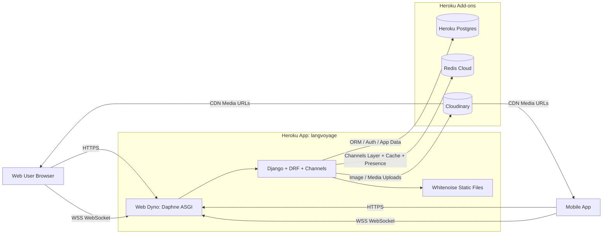

# ChatApp Architecture (Heroku)

## Notes

- `Procfile` runs Daphne for HTTP + WebSocket traffic.
- Postgres is the primary persistent database.
- Redis Cloud backs Channels real-time coordination and cache.
- Cloudinary stores media off dyno filesystem.
