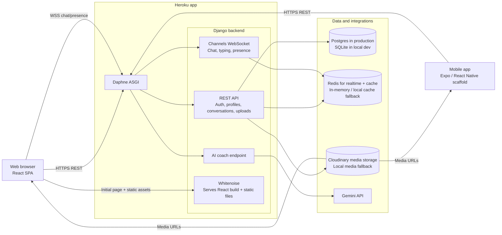

# LangVoyage Architecture

```mermaid
flowchart LR
    B[Web browser<br/>React SPA]
    M[Mobile app<br/>Expo / React Native scaffold]

    subgraph Heroku["Heroku app"]
      D[Daphne ASGI]

      subgraph Backend["Django backend"]
        API[REST API<br/>Auth, profiles, conversations, uploads]
        WS[Channels WebSocket<br/>Chat, typing, presence]
        COACH[AI coach endpoint]
        STATIC[Whitenoise<br/>Serves React build + static files]
      end
    end

    subgraph Data["Data and integrations"]
      PG[(Postgres in production<br/>SQLite in local dev)]
      R[(Redis for realtime + cache<br/>In-memory / local cache fallback)]
      C[(Cloudinary media storage<br/>Local media fallback)]
      G[Gemini API]
    end

    B -->|Initial page + static assets| STATIC
    B -->|HTTPS REST| D
    B -->|WSS chat/presence| D
    M -->|HTTPS REST| D

    D --> API
    D --> WS
    D --> COACH

    API --> PG
    API --> C
    API --> R
    WS --> R
    COACH --> G
    C -->|Media URLs| B
    C -->|Media URLs| M
```

## Notes

- The web app is a React SPA built in `frontend/` and served from Django via Whitenoise in production.
- The mobile app in `mobile/` is an Expo / React Native client scaffold that currently talks to the backend over HTTPS.
- Django runs behind Daphne/ASGI and exposes both REST endpoints and Channels-based WebSocket endpoints.
- Production uses Postgres; local development falls back to SQLite.
- Redis is used for channels and cache when enabled; local development falls back to in-memory channel and cache backends.
- Media can be stored in Cloudinary when configured, otherwise Django serves local media files.
- The AI coach calls the Gemini API through the backend.
