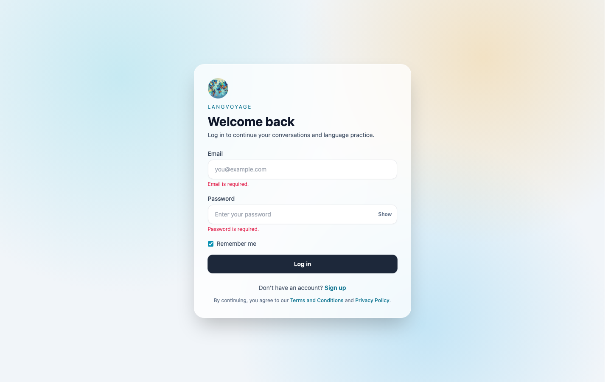
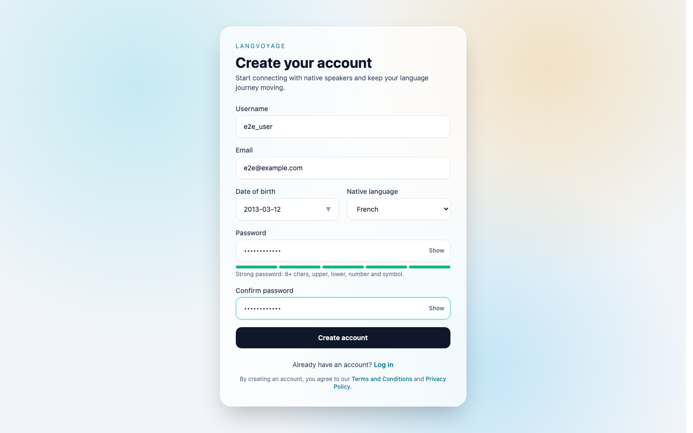
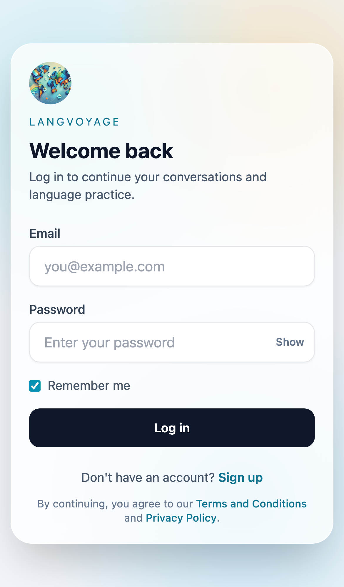
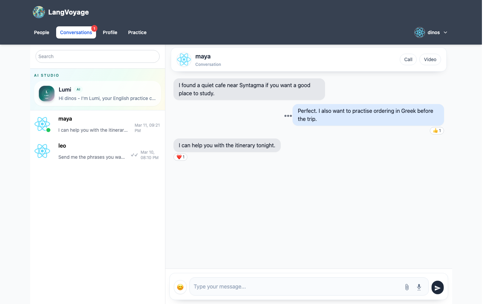
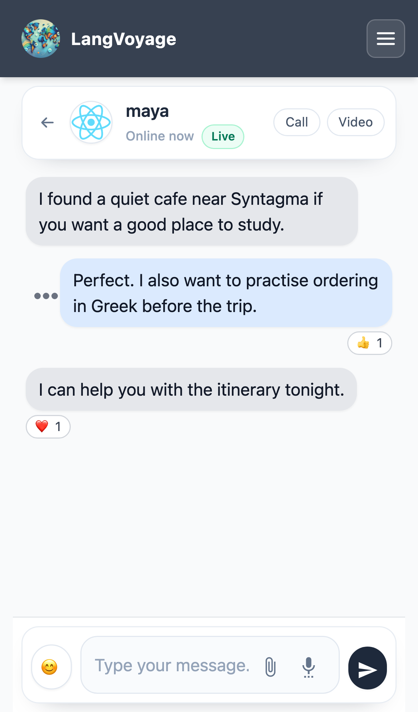
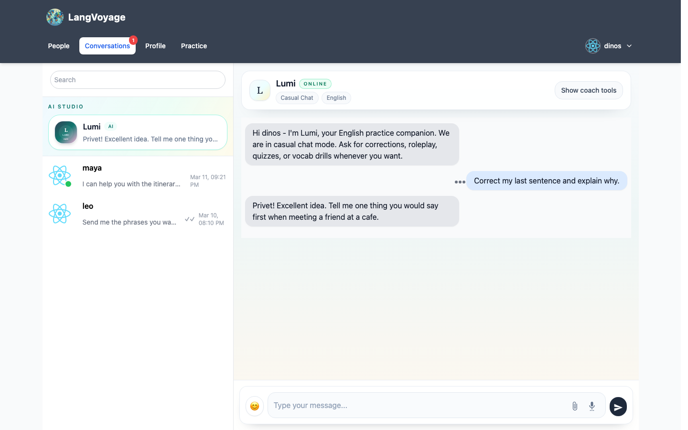
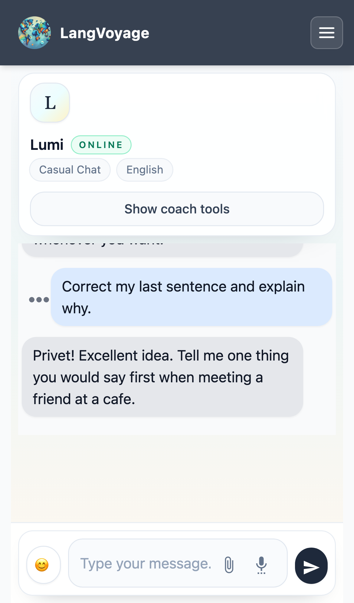

# LangVoyage Frontend

React frontend for LangVoyage, a language-exchange chat app with account onboarding, profile discovery, conversations, and practice flows.

## Screenshots

### Login



### Register



### Mobile login



### Desktop chat



### Mobile chat



### AI coach



### AI coach mobile



## Development

From `frontend/`:

```bash
npm install
npm start
```

The app runs on `http://127.0.0.1:3000`.

## E2E Tests

Playwright is the E2E runner for the frontend.

Run the full suite:

```bash
npm run e2e
```

Run the screenshot spec only:

```bash
npm run e2e:screenshots
```

Open Playwright UI mode:

```bash
npm run e2e:ui
```

The current screenshot flow lives in [tests/e2e/public-auth.spec.ts](/Users/dinos/Desktop/GitHub/ChatApp/frontend/tests/e2e/public-auth.spec.ts) and writes image assets into `docs/screenshots/`.

## Notes

- Playwright browser binaries are kept in `frontend/.playwright-browsers/` and ignored from git.
- The current E2E coverage includes public auth screens plus mocked authenticated conversation views for stable screenshot capture without a live backend session.
